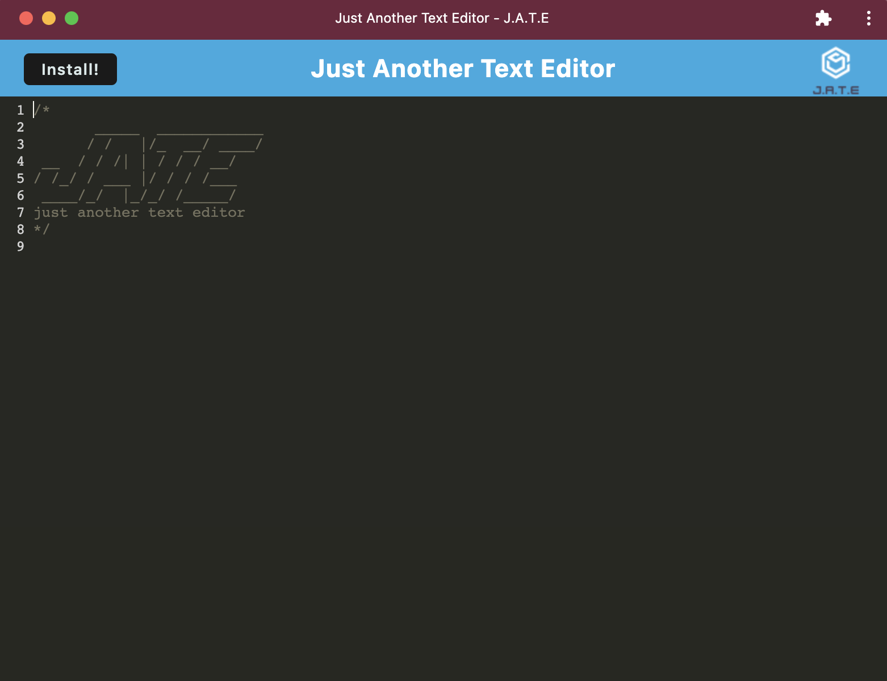

# J.A.T.E.

## Description

This application allows you the functionality of a simple text editor that you can install on your desktop or mobile device. It can be used on or off line and will still have persistant data and you will not lose your notes or saved text.

## Table of Contents

- [Installation](#installation)
- [Usage](#usage)
- [Tests](#tests)
- [Contributing](#contributing)
- [License](#license)
- [Link](#link)
- [Screenshot](#screenshot)
- [Questions](#questions)

## Installation

    npm i

## Usage

Simply follow the link to the deployed heroku app and click the install button in the top left corner. Once installed, start typing and saving your thoughts in this text editor.

## Tests

No tests have been written, however feel free to write some and test away!

## Contributing

Please follow the guidelines outlined by the Contributors Covenant.

## License

This project is licensed under the MIT license. (c) 2022

## Link

https://obscure-plains-41681.herokuapp.com/

## Screenshot

## Questions

#### If you have questions or would like to contact me for more information, you can find me on Git Hub or send me and email.

- [GitHub](https://github.com/elliscj)
- [Email](elliscj@colorado.edu)
